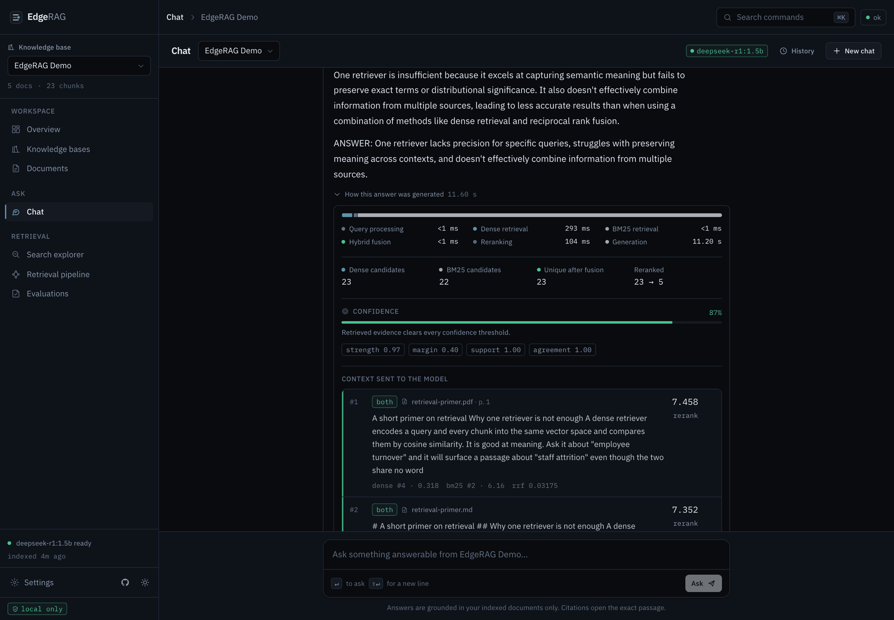
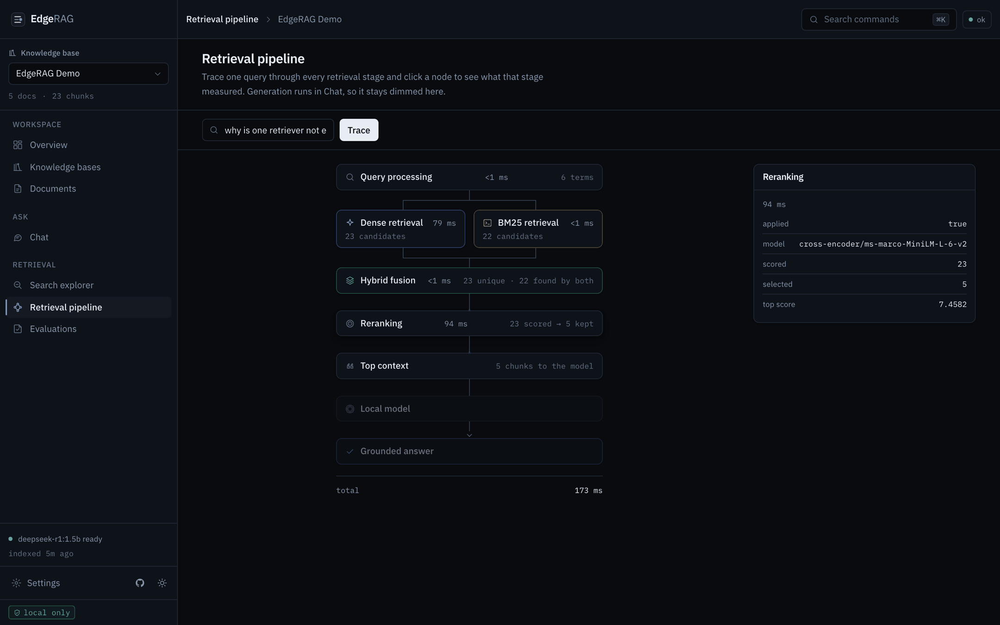
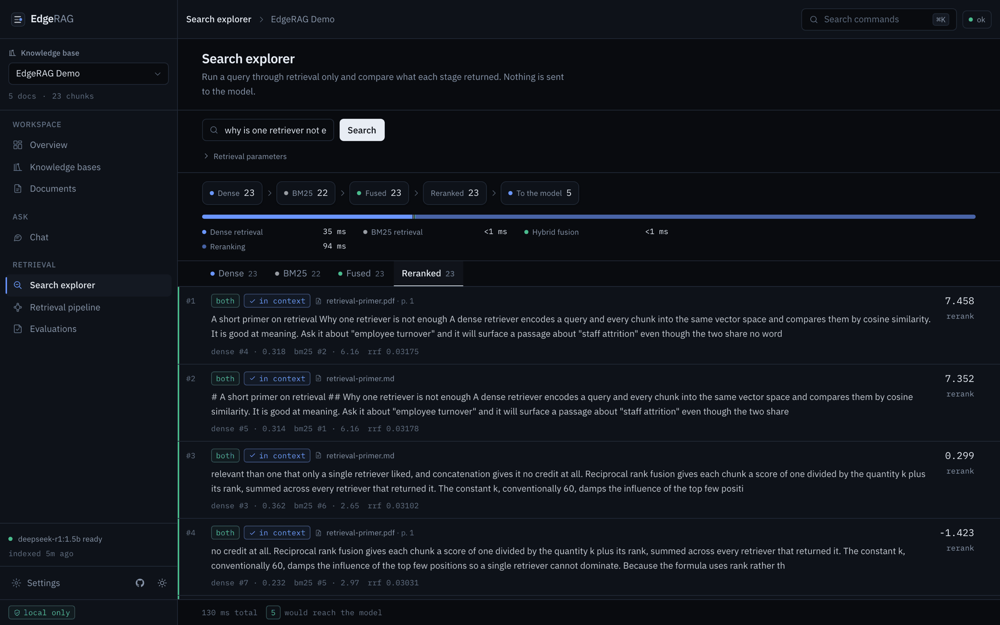
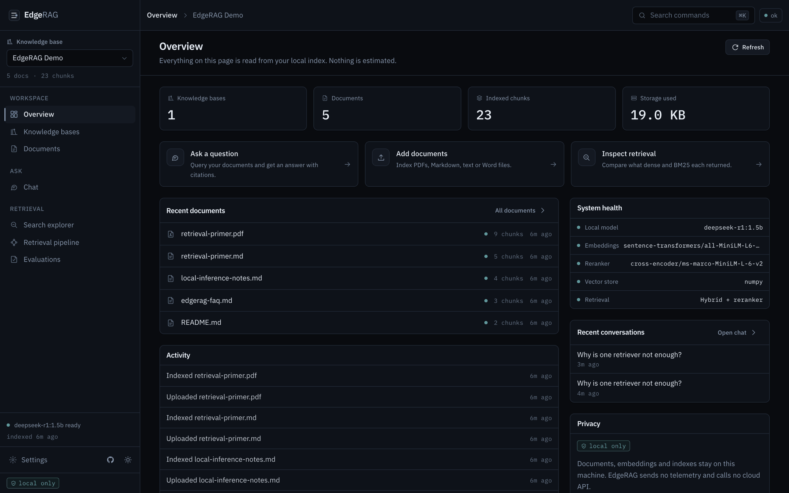
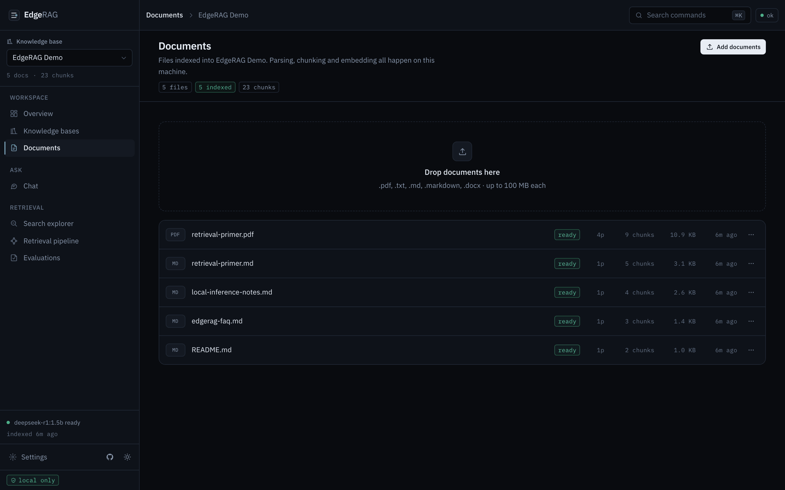
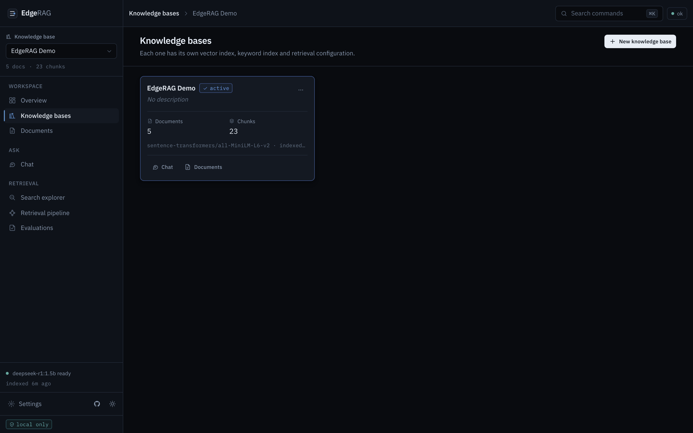
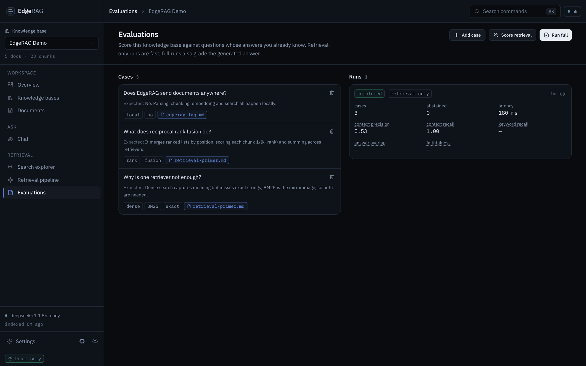
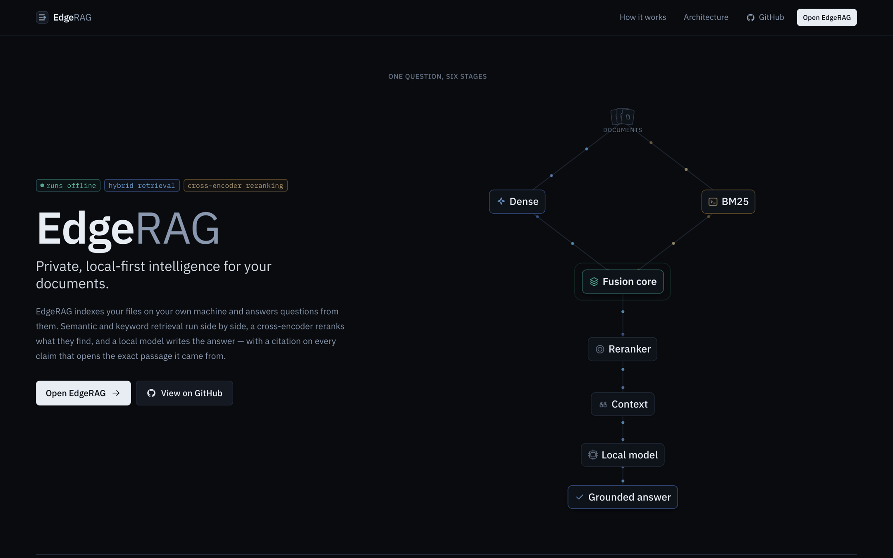
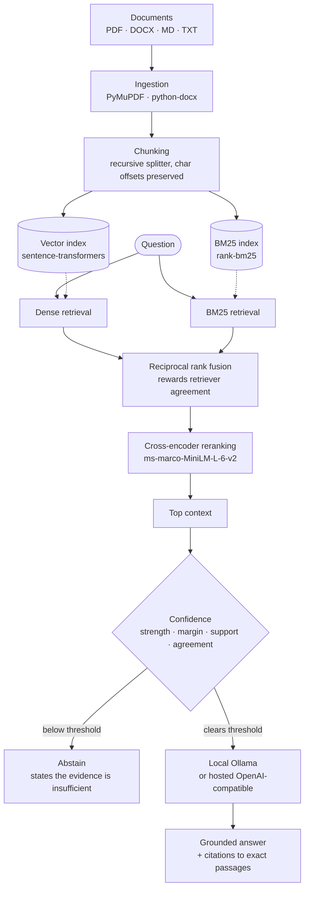

<div align="center">

# EdgeRAG

### Private, local-first intelligence for your documents.

**Hybrid retrieval · cross-encoder reranking · grounded citations · local inference — and it abstains when the evidence is thin.**

[**▶ Try the live demo**](https://edgerag-production.up.railway.app) · [Documentation](docs/) · [Architecture](#architecture) · [Quick start](#quick-start)

[](https://github.com/tanmaytyagii/EdgeRAG/actions/workflows/ci.yml)
[](LICENSE)
[](backend/pyproject.toml)
[](frontend/package.json)
[](docker-compose.yml)

</div>

---

EdgeRAG answers questions from your own documents, on your own machine, and shows you exactly which
passages produced every sentence. Semantic and keyword retrieval run side by side, a cross-encoder
reranks what they find, and a local model writes the answer.

Most RAG systems always answer. EdgeRAG scores the retrieved evidence first and **declines when it
is too weak** — because a confident answer built on a chunk the reranker scored −1.58 is worse than
no answer at all.

<div align="center">
  
  <sub><i>A real answer over the bundled sample corpus — with the stage timings, candidate counts, confidence signals and exact context that produced it.</i></sub>
</div>

---

## Live demo

### [→ edgerag-production.up.railway.app](https://edgerag-production.up.railway.app)

No install, no signup. Ask a question, then open the retrieval trace behind the answer.

> **The public demo is deliberately not the private product.** It is **read-only**, indexes only the
> five bundled CC0 sample documents, and answers through a **hosted** model. Ingestion, deletion and
> settings writes return `403 demo_read_only`. **Do not upload private documents to it** — that is
> what local mode is for, and the demo refuses uploads so the question never arises.

| | **Local mode** | **Public demo** |
|---|---|---|
| Documents | Your own files | Five bundled CC0 samples |
| Embeddings | Local (`all-MiniLM-L6-v2`) | On the server |
| Reranker | Local (`ms-marco-MiniLM-L-6-v2`) | On the server |
| Language model | Local Ollama | Hosted, OpenAI-compatible |
| Network calls | Only to your model host | To the hosted provider |
| Writes | Full — index, delete, configure | Read-only |
| Runs offline | Yes | No |

---

## Why EdgeRAG

**Retrieval is not enough.** EdgeRAG also decides when the evidence is not strong enough to answer.

- **One retriever is not enough either.** Dense search knows *turnover* and *attrition* mean the
  same thing; it reliably misses exact strings like a version number. BM25 is the mirror image.
  EdgeRAG runs both and fuses them by rank, promoting passages that both retrievers found.
- **Reranking is where precision comes from.** Fusion produces recall. A cross-encoder reads the
  query and each candidate *together* and reorders the pool down to the few that actually answer.
- **An answer you cannot check is a guess.** Every claim carries a citation that opens the source at
  the exact passage. Markers the model invents are stripped before you see them.
- **It refuses when it should.** Confidence blends four independent signals — strength, margin,
  support and retriever agreement — rather than one threshold on an uncalibrated logit.
- **Nothing is hidden.** Per-stage latency, candidate counts and every score are exposed in the UI.
  The dashboard shows real numbers from your index or an honest empty state; it never estimates.

---

## Product

| Retrieval pipeline | Search explorer |
| --- | --- |
|  |  |
| Trace one query through every stage. Click a node for the metrics that stage actually measured. | Compare what each retriever returned, with every score the pipeline assigned. |

| Overview | Documents |
| --- | --- |
|  |  |
| Counts read live from the local index. Nothing is estimated. | Parsing, chunking and embedding, with per-stage progress. |

| Knowledge bases | Evaluations |
| --- | --- |
|  |  |
| Each has its own vector index, keyword index and retrieval configuration. | Score retrieval against questions whose answers you already know. |

<details>
<summary>Landing page</summary>



</details>

---

## Architecture



| Stage | What it does |
| --- | --- |
| **Ingestion** | Parses PDF, DOCX, Markdown and text. Character offsets are preserved so a citation can point at an exact passage. |
| **Chunking** | Recursive character splitter — 800 characters with 100 of overlap by default. |
| **Dense retrieval** | Cosine search over a persisted NumPy store, or Chroma. |
| **BM25 retrieval** | Okapi BM25 over the same corpus, persisted alongside the vectors. |
| **Fusion** | Reciprocal rank fusion merges both lists by position, so incomparable score scales never have to be reconciled. |
| **Reranking** | A cross-encoder scores query and candidate together and keeps the best few. Optional, and clearly reported when off. |
| **Confidence** | Blends four signals; below the threshold EdgeRAG abstains instead of generating. |
| **Generation** | Ollama locally, or any OpenAI-compatible provider when hosted. Streams token by token. |

Deeper detail: [architecture](docs/architecture.md) · [RAG pipeline](docs/rag-pipeline.md) ·
[retrieval](docs/retrieval.md) · [reranking](docs/reranking.md) · [ingestion](docs/ingestion.md)

---

## Features

| | |
| --- | --- |
| **Retrieval** | Dense vector search · BM25 · weighted reciprocal rank fusion · cross-encoder reranking · per-request parameter overrides |
| **Grounding** | Four-signal confidence scoring · configurable abstention thresholds · citations carrying document, page and character offsets · invented markers stripped |
| **Workspace** | Knowledge bases · ingestion with per-stage progress · chat with streaming answers · search explorer · retrieval pipeline trace · evaluations · settings |
| **Providers** | Embeddings: sentence-transformers or a deterministic dev hasher · Vector store: NumPy or Chroma · Reranker: cross-encoder or none · LLM: Ollama or OpenAI-compatible |
| **Developer** | Typed CLI · REST API with OpenAPI docs · Docker and compose · 55 tests · ruff · frontend type-checking · `doctor` diagnostics |

---

## Quick start

### Fastest local setup

```bash
git clone https://github.com/tanmaytyagii/EdgeRAG.git
cd EdgeRAG

make setup            # venv, backend with ML extras, frontend build, .env
ollama pull deepseek-r1:1.5b

make doctor           # verify Python, dependencies, Ollama, models, storage
make demo             # index the bundled CC0 samples
make serve            # http://localhost:8000
```

`make help` lists every target. Prefer to do it by hand?

```bash
python -m venv .venv && source .venv/bin/activate
pip install -e "backend[all,dev]"     # or "backend[dev]" for a torch-free install
cd frontend && npm install && npm run build && cd ..
edgerag serve
```

### Docker

```bash
docker compose up --build
docker compose exec ollama ollama pull deepseek-r1:1.5b
```

Starts Ollama and EdgeRAG together, both bound to localhost. The image ships torch by default, so
semantic embeddings and the reranker work out of the box.

### Without Ollama

EdgeRAG needs a model host to *generate*. Retrieval, the search explorer and the pipeline trace all
work without one — and `edgerag query --retrieval-only` skips generation entirely.

---

## Command line

Everything the interface does, the CLI does too.

```bash
edgerag --help                                   # all commands
edgerag doctor                                   # dependencies, models, storage, indexes
edgerag demo                                     # index the bundled samples
edgerag ingest ./docs --kb "Handbook"            # index a file or a directory
edgerag query "why is one retriever not enough?" # answer with citations
edgerag query "..." --retrieval-only             # retrieval only, no generation
edgerag list                                     # knowledge bases and their contents
edgerag models                                   # configured vs actually installed
edgerag eval --kb "Handbook"                     # score stored evaluation cases
edgerag serve                                    # API + web UI
```

### The usual flow in the UI

Create a knowledge base → drop in documents → ask a question in **Chat** → open *How this answer was
generated* to see the stages, candidate counts and confidence → click a citation to open the source
at the exact passage. **Search explorer** and **Retrieval pipeline** let you inspect retrieval on its
own, without spending a generation.

---

## Configuration

Every tunable lives in one settings model, layered:

```
defaults  <  .env  <  environment variables  <  Settings page
```

Nested keys use a double underscore. Nothing is required — EdgeRAG runs with no `.env` at all.

```bash
EDGERAG_DATA_DIR=~/.edgerag                 # documents, indexes, SQLite database
EDGERAG_LLM__MODEL=deepseek-r1:1.5b
EDGERAG_RETRIEVAL__CONTEXT_TOP_K=5          # chunks that reach the model
EDGERAG_CONFIDENCE__MIN_CONFIDENCE=0.35     # below this, EdgeRAG abstains
```

Full reference: [`.env.example`](.env.example) · [configuration](docs/configuration.md) ·
[choosing local models](docs/local-models.md)

---

## Tech stack

| Layer | Built with |
| --- | --- |
| **Backend** | Python 3.10–3.12 · FastAPI · Pydantic v2 · SQLAlchemy · SQLite · Typer · uvicorn |
| **Retrieval** | sentence-transformers · rank-bm25 · NumPy · Chroma (optional) · PyMuPDF · python-docx |
| **Generation** | Ollama (local) · any OpenAI-compatible provider (hosted) |
| **Frontend** | React 18 · TypeScript · Vite · Tailwind CSS · React Router |
| **Infrastructure** | Docker · docker compose · Railway (backend) · Vercel (frontend) |

---

## Engineering

- **55 backend tests** covering the API, chunker, fusion, citations, confidence, pipeline, config and
  paths — they pass without torch, without Ollama and without network access.
- **CI on every push**: backend across Python 3.10, 3.11 and 3.12; frontend type-check and build;
  Docker image build. See [`ci.yml`](.github/workflows/ci.yml).
- **`ruff`** for linting, **`tsc --noEmit`** for frontend types.
- **`edgerag doctor`** diagnoses dependencies, models, storage and indexes before you hit a failure.
- **Providers sit behind protocols** — swapping Ollama for another backend means adding a class, not
  editing the pipeline.
- **Errors carry remediation**, not stack traces. Internal detail appears only in developer mode.

---

## Security & privacy

Local mode makes one kind of network call: to the model host you configure, which defaults to Ollama
on localhost. No accounts, no cloud storage, no analytics endpoint. Turn off your network and it
keeps working.

Uploads are extension-allowlisted, size-capped, filename-sanitised and resolved under the storage
root. The hosted demo additionally refuses every write, and its model API key is server-side only —
never returned by the API, never sent to the browser.

**The public demo does not provide private or offline processing.** Use local mode for anything
confidential.

Reporting a vulnerability: [SECURITY.md](SECURITY.md)

---

## Project structure

```
EdgeRAG/
├── backend/edgerag/
│   ├── api/            FastAPI routes, dependencies, app factory
│   ├── rag/            chunker, retriever, fusion, reranking, confidence, citations
│   ├── providers/      embeddings, LLM, reranker, vector store — behind protocols
│   ├── services/       ingestion, engine (cached pipelines), demo seeding
│   ├── db/             SQLAlchemy models and session handling
│   └── cli.py          the `edgerag` command
├── frontend/src/       React UI — pages, components, typed API client
├── docs/               architecture, retrieval, reranking, evaluation, deployment, API
├── samples/            CC0 documents used by `edgerag demo`
├── screenshots/        the images in this README
├── scripts/            setup and screenshot capture
├── notebooks/          the offline prototype this project grew out of
├── Dockerfile          multi-stage: frontend build → Python runtime
└── docker-compose.yml  EdgeRAG + Ollama, localhost only
```

---

## Documentation

| | |
| --- | --- |
| [Architecture](docs/architecture.md) | How the pieces fit together |
| [RAG pipeline](docs/rag-pipeline.md) · [Retrieval](docs/retrieval.md) · [Reranking](docs/reranking.md) | Stage-by-stage detail |
| [Ingestion](docs/ingestion.md) · [Evaluation](docs/evaluation.md) | Getting documents in, measuring what comes out |
| [Configuration](docs/configuration.md) · [Local models](docs/local-models.md) | Tuning and model choice |
| [API](docs/api.md) | REST endpoints, also live at `/api/docs` |
| [Deployment](docs/deployment.md) | Publishing a demo on Railway + Vercel |
| [Contributing](CONTRIBUTING.md) · [Code of Conduct](CODE_OF_CONDUCT.md) · [Security](SECURITY.md) | Working on EdgeRAG |
| [Changelog](CHANGELOG.md) · [Roadmap](ROADMAP.md) | Where it has been, where it is going |

---

## Limitations

- Exact NumPy vector search is correct and fast to tens of thousands of chunks; beyond that it wants
  approximate search — see the [roadmap](ROADMAP.md).
- Tables currently flatten into prose and retrieve poorly.
- Answer quality tracks the model you run. Small local models such as `deepseek-r1:1.5b` are fast but
  do not reliably emit citation markers; larger models cite better.
- There is no authentication. Local mode binds to localhost deliberately.
- Retrieval quality has not been benchmarked on a public dataset. A semantic benchmark suite is on
  the [roadmap](ROADMAP.md); until then this README publishes no quality numbers.

---

<div align="center">

**Built for people who want RAG to be useful without turning the evidence into a black box.**

[Live demo](https://edgerag-production.up.railway.app) · [GitHub](https://github.com/tanmaytyagii/EdgeRAG) · [Contributing](CONTRIBUTING.md)

Apache-2.0

</div>
