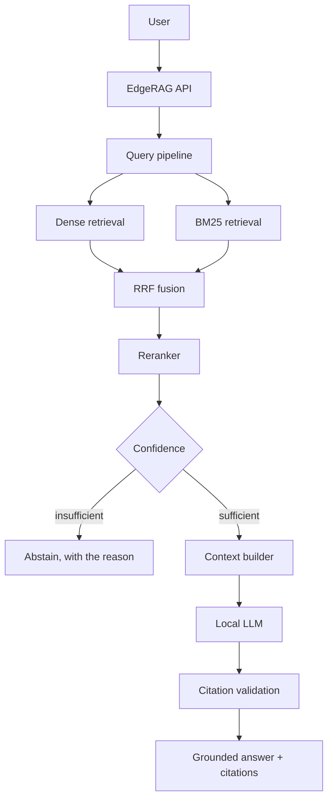
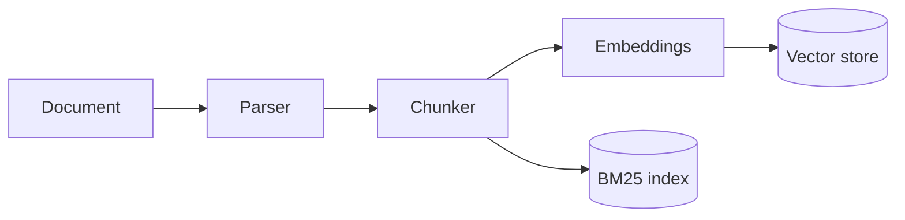

<div align="center">

# EdgeRAG

### Private AI for your documents.

**Hybrid retrieval. Reranking. Grounded citations. Local inference.**

EdgeRAG is a local-first Retrieval-Augmented Generation workspace that combines semantic
retrieval, BM25 keyword retrieval, reciprocal-rank fusion, cross-encoder reranking,
confidence-aware abstention and locally hosted LLM generation.

[](LICENSE)
[](backend/pyproject.toml)
[](frontend/package.json)
[](https://github.com/tanmaytyagii/EdgeRAG/actions/workflows/ci.yml)
[](docker-compose.yml)

[Quick start](#quick-start) · [Documentation](docs/) · [Architecture](#architecture) · [CLI](#command-line) · [Limitations](#limitations)

</div>

---

## Contents

1. [What EdgeRAG is](#what-edgerag-is)
2. [Features](#features)
3. [Architecture](#architecture)
4. [Why hybrid retrieval matters](#why-hybrid-retrieval-matters)
5. [Quick start](#quick-start)
6. [Docker](#docker)
7. [Deploying a public demo](#deploying-a-public-demo)
8. [The doctor command](#the-doctor-command)
9. [Command line](#command-line)
10. [Your first knowledge base](#your-first-knowledge-base)
11. [The interface](#the-interface)
12. [Retrieval observability](#retrieval-observability)
13. [Grounding and abstention](#grounding-and-abstention)
14. [Configuration](#configuration)
15. [Choosing models](#choosing-models)
16. [Evaluation](#evaluation)
17. [API](#api)
18. [Privacy](#privacy)
19. [Benchmarks](#benchmarks)
20. [Limitations](#limitations)
21. [Screenshots](#screenshots)
22. [Project layout](#project-layout)
23. [Development](#development)
24. [Documentation](#documentation)
25. [Roadmap](#roadmap)
26. [Contributing](#contributing)
27. [License](#license)

---

## What EdgeRAG is

EdgeRAG turns a folder of documents into a question-answering system that runs on your own
machine. It parses your files, splits them into overlapping chunks, builds both a dense vector
index and a BM25 keyword index, fuses the two at query time, reranks the result with a
cross-encoder, and asks a local model to answer using only the passages it retrieved.

It is not a chat wrapper. The retrieval pipeline is the product: you can watch each stage run,
inspect what every retriever returned, click a citation to open the source at the exact
passage, and see why the system chose to answer — or to refuse.

## Features

### Local-first
Documents, embeddings, indexes and conversations stay in a directory on your machine. No cloud
API is required for the local workflow.

### Hybrid retrieval
Dense semantic retrieval and BM25 lexical retrieval run over the same chunks, with independent,
configurable candidate budgets.

### Reciprocal rank fusion
The two result lists are combined by rank, not concatenated. A chunk both retrievers found is
promoted above a chunk only one of them liked.

### Reranking
An optional cross-encoder scores the fused pool and selects the chunks that reach the model.
When it is disabled, EdgeRAG says so rather than silently degrading.

### Grounded answers
The system prompt constrains the model to the retrieved context, requires a citation for every
claim, and requires an explicit statement when the context does not support an answer.

### Citation validation
Every `[n]` marker is checked against the context that was actually assembled. Markers with no
referent are removed. Citations map back to a document, page and character span.

### Confidence and abstention
A four-signal estimate — top score, margin over the runner-up, number of supporting chunks, and
whether both retrievers agreed — decides whether to answer at all.

### Retrieval explorer
Run a query without generation and compare the dense, BM25, fused and reranked lists
side by side, with every per-stage rank and score shown separately.

### Local LLM
Generation runs through Ollama on your machine. Answers stream token by token.

### Developer CLI
`edgerag ingest`, `query`, `serve`, `doctor`, `list`, `models`, `eval`, `demo`.

## Architecture

Query path:



Ingestion path:



Every external capability sits behind a `typing.Protocol` — `EmbeddingProvider`, `VectorStore`,
`RerankerProvider`, `LLMProvider`, `DocumentLoader`. Adding llama.cpp or pgvector means writing
one class, not touching the pipeline. `RAGPipeline` has no knowledge of FastAPI and is exercised
directly in the tests against a scripted LLM. See [docs/architecture.md](docs/architecture.md).

## Why hybrid retrieval matters

Dense retrieval understands that *turnover* and *attrition* mean the same thing. It regularly
fails on exact strings — a CVE identifier, a section number, an error code — because those
tokens carry almost no semantic signal. BM25 is the mirror image: it finds the identifier
instantly and misses the paraphrase.

Running both and fusing them by rank fixes both failure modes, and rewards agreement:

```
score(chunk) = Σ  weight_retriever / (k + rank_retriever(chunk))
```

A chunk at dense rank 3 and BM25 rank 1 scores `1/63 + 1/61 = 0.0323`, beating a chunk at dense
rank 1 alone (`1/61 = 0.0164`). This ordering is asserted in `backend/tests/test_fusion.py`.

**A measured example.** Querying `CVE-2021-44228` against the bundled sample corpus (5 documents,
23 chunks) produced this trace:

| Stage | Result |
| --- | --- |
| Dense retrieval | the relevant chunk ranked **9th** |
| BM25 retrieval | the same chunk ranked **1st**, score 4.297 |
| RRF fusion | promoted it to **1st**, marked `found_by_both` |

Concatenating the two lists and de-duplicating — the approach this project's research prototype
used — would have left that chunk in ninth place, below eight semantically-similar but wrong
passages. See [Benchmarks](#benchmarks) for how this run was configured.

Reranking then supplies precision: a cross-encoder reads the query and each candidate *together*,
which a bi-encoder cannot do, and reorders the fused pool down to the few chunks that actually
answer the question. Details in [docs/retrieval.md](docs/retrieval.md) and
[docs/reranking.md](docs/reranking.md).

## Quick start

Requirements: **Python ≥ 3.10**, **Node ≥ 18** (only to build the UI), and
[**Ollama**](https://ollama.com) for generation.

```bash
git clone https://github.com/tanmaytyagii/EdgeRAG
cd EdgeRAG

python -m venv .venv
source .venv/bin/activate          # Windows: .venv\Scripts\activate

# Backend, with semantic embeddings and the cross-encoder reranker.
# This pulls torch; expect a few hundred MB.
pip install -e "backend[all,dev]"

# Build the web UI into backend/static
cd frontend
npm install
npm run build
cd ..

# A small, fast model to start with
ollama pull deepseek-r1:1.5b

edgerag doctor                     # verify the environment first
edgerag serve                      # http://localhost:8000
```

Or, equivalently, `./scripts/setup.sh` followed by `edgerag doctor && edgerag serve`.

### Installing without the ML stack

```bash
pip install -e "backend[dev]"      # no torch, no sentence-transformers
```

Ingestion, BM25 retrieval, the API, the CLI and the whole UI work. The embedding provider falls
back to `hash-dev`, which is deterministic but **not semantic** — it is for CI and smoke tests,
never for judging retrieval quality. EdgeRAG labels this state in Settings and in `doctor`
rather than pretending otherwise.

## Docker

```bash
docker compose up --build
docker compose exec ollama ollama pull deepseek-r1:1.5b
```

This starts Ollama and EdgeRAG together with named volumes for models and index data, both
bound to localhost only.

The default image is deliberately slim and ships **without** torch, so it starts with `hash-dev`
embeddings and no reranker. For semantic search in Docker, change the install line in the
`Dockerfile` to `pip install -e "./backend[all]"` and set
`EDGERAG_EMBEDDING__PROVIDER=sentence-transformers`. See
[docs/local-models.md](docs/local-models.md).

## Deploying a public demo

EdgeRAG is local-first, and that is the product. It can *also* be published as a
public demo — a Vercel frontend on a Railway backend, answering over the bundled
CC0 samples through a hosted model — so people can try it without installing
anything.

```
LOCAL                                  PUBLIC DEMO
your machine → your documents          browser → Vercel → Railway
  → local embeddings + reranker          → bundled sample documents
  → local Ollama                         → local embeddings + reranker
  → private answer                       → hosted model → grounded answer
```

The demo is **read-only**: ingestion, deletion and settings writes all return
`403 demo_read_only`, because its storage is ephemeral and its audience is
anonymous. None of this is on by default, and none of it affects a local install
— set no environment variables and EdgeRAG behaves exactly as it always has.

Two settings switch it on:

```bash
EDGERAG_DEMO_MODE=true              # refuse writes
EDGERAG_DEMO_SEED_ON_STARTUP=true   # index samples/ on first boot
```

and the model moves from Ollama to any OpenAI-compatible provider:

```bash
EDGERAG_LLM__PROVIDER=openai-compatible
EDGERAG_LLM__BASE_URL=https://api.groq.com/openai/v1
EDGERAG_LLM__MODEL=llama-3.1-8b-instant
EDGERAG_LLM__API_KEY=...    # server-side only; never sent to the browser
```

Full instructions — build arguments, environment variables, plan sizing and the
security checklist — are in **[docs/deployment.md](docs/deployment.md)**.

> Do not upload private documents to a public demo. That is what the local mode
> is for, and the demo refuses uploads precisely so the question does not arise.

## The doctor command

```bash
edgerag doctor
```

Diagnoses the environment before you rely on it, and prints what to run for anything missing:

| Check | What it verifies |
| --- | --- |
| `python` | Interpreter version |
| `fastapi`, `numpy`, `rank-bm25`, `pymupdf` | Required dependencies are importable |
| `sentence-transformers`, `chromadb`, `python-docx` | Optional extras, reported as `warn` when absent |
| `storage` | Data directory is writable, and free space |
| `database` | Knowledge base and document counts |
| `ollama` | Host reachable, and whether the configured model is pulled |
| `vector store` | Active provider |
| `embeddings` | Active model, and whether it is loaded or lazy |
| `reranker` | Active model, or a warning that precision will be lower |

Expected failure states, all non-fatal and all with a remediation line:

- `ollama · fail · unreachable at http://localhost:11434` → retrieval still works, generation does not.
- `reranker · warn · disabled` → results are ordered by fusion score.
- `sentence-transformers · warn · optional, not installed` → embeddings fall back to `hash-dev`.

## Command line

```
edgerag serve [--host --port --reload]   Run the API and the built UI
edgerag doctor                           Diagnose the environment
edgerag demo                             Index the bundled CC0 samples
edgerag ingest PATH --kb NAME            Index a file or directory
edgerag list                             Knowledge bases and their sizes
edgerag query "..." --kb NAME            Ask a question; prints citations
edgerag query "..." --retrieval-only     Retrieval without generation
edgerag query "..." --json               Machine-readable output
edgerag models                           Installed Ollama models
edgerag eval --kb NAME                   Run the evaluation suite
edgerag version
```

Real output from `edgerag list` after `edgerag demo`:

```
 Knowledge base  Documents  Chunks  Last indexed
 EdgeRAG Demo    5          23      2026-09-09 15:01
```

Retrieval without a model running, which is the fastest way to tune parameters:

```bash
edgerag query "why is one retriever not enough?" --kb "EdgeRAG Demo" --retrieval-only
```

## Your first knowledge base

The repository ships original, Creative-Commons-Zero sample documents in
[`samples/`](samples/) so the whole flow works immediately:

```bash
edgerag demo
edgerag query "What is reciprocal rank fusion?" --kb "EdgeRAG Demo"
```

Then add your own:

```bash
edgerag ingest ~/Documents/handbook --kb "Handbook"
```

or drag files onto the Documents page. Supported: `.pdf`, `.txt`, `.md`, `.markdown`, `.docx`.

> **On sample data.** EdgeRAG ships no third-party documents. The samples are original text
> written for this repository. Point it at your own files — nothing is uploaded anywhere.

## The interface

| Page | What it is for |
| --- | --- |
| **Overview** | Real counts read from your index, live indexing status, stack health. No decorative statistics. |
| **Knowledge bases** | Create, rename, duplicate, export, delete. Each has its own indexes. |
| **Documents** | Drag-and-drop ingestion with per-stage progress, ingestion logs, cancel, re-index, remove. |
| **Chat** | Streaming grounded answers, citation chips, expandable "How this answer was generated". |
| **Search explorer** | One query through dense, BM25, fused and reranked views, every score shown separately. |
| **Retrieval pipeline** | A clickable trace of a single query, populated only from real measurements. |
| **Evaluations** | Your own test cases, scored for retrieval quality, grounding and latency. |
| **Settings** | Retrieval budgets, chunking, models, abstention thresholds, privacy, developer mode. |

Keyboard: `⌘K` command palette, `⌘↵` to ask, `Esc` to close. Everything is reachable by keyboard,
focus is always visible, and motion respects `prefers-reduced-motion`.

## Retrieval observability

This is what separates EdgeRAG from a prompt with a vector search bolted on. For every query,
the API returns and the UI displays:

| Exposed | Where |
| --- | --- |
| Dense candidates, with rank and cosine score | Search Explorer, answer trace |
| BM25 candidates, with rank and BM25 score | Search Explorer, answer trace |
| Fused list, with RRF score and a `found_by_both` marker | Search Explorer |
| Reranked list, with cross-encoder logits, or an explicit `skipped` | Search Explorer, answer trace |
| Final context — exactly which chunks reached the model | Answer trace |
| Per-stage latency and candidate counts | Pipeline page, answer trace |
| Confidence, its four component signals, and the reason | Answer trace |
| Citation coverage | Answer trace, evaluation runs |

A real trace, from `POST /api/search` on the sample corpus:

```
query_processing     0.00 ms  {'characters': 14, 'terms': 1}
dense_retrieval      0.59 ms  {'candidates': 23, 'model': 'hash-dev', 'top_score': 0.0}
sparse_retrieval     2.55 ms  {'candidates': 4, 'algorithm': 'BM25Okapi', 'top_score': 4.2973}
hybrid_fusion        0.05 ms  {'unique_candidates': 23, 'found_by_both': 4, 'strategy': 'RRF(k=60)'}
reranking            0.00 ms  {'applied': False, 'reason': 'Reranker disabled', 'scored': 0, 'selected': 5}
```

The trace the UI renders is the same object the pipeline measured. There is no second,
decorative source of metrics — a skipped stage is recorded as skipped rather than omitted.

## Grounding and abstention

Prompting a model to stay in its context is necessary and not sufficient, so EdgeRAG also:

- validates each emitted `[n]` against the assembled context and removes markers with no referent;
- computes **citation coverage** — the share of claims carrying a valid citation;
- blends four confidence signals rather than thresholding a single uncalibrated logit;
- refuses when that estimate falls below the configured floor, showing the reason and each signal;
- strips `<think>` reasoning blocks from answers and from the stream.

In this project's research prototype, the top reranker score for a recorded query was **−1.58** —
strongly negative — and the notebook printed a warning and answered confidently anyway. The same
inputs now abstain, which is asserted in `backend/tests/test_confidence.py`.

## Configuration

Every setting has a default; nothing is required. Configure by environment variable, `.env` file,
or the Settings page. Copy [`.env.example`](.env.example) to `.env` to start. Nested settings use
a double underscore:

```bash
EDGERAG_LLM__MODEL=qwen2.5:7b
EDGERAG_RETRIEVAL__CONTEXT_TOP_K=8
EDGERAG_CHUNKING__CHUNK_SIZE=1200
```

Changing chunking or the embedding model does **not** silently rewrite existing indexes. EdgeRAG
reports that a re-index is needed and leaves the choice to you.

`backend/tests/test_config.py` asserts that every variable documented in `.env.example` is one the
application actually reads, and that the file loads as written. Full reference:
[docs/configuration.md](docs/configuration.md).

## Choosing models

| Role | Default | Size | Notes |
| --- | --- | --- | --- |
| Generation | `deepseek-r1:1.5b` | ~1.1 GB | Any Ollama model. Larger answers better and slower. |
| Embeddings | `all-MiniLM-L6-v2` | ~90 MB | 384 dimensions, fine on CPU. |
| Reranking | `ms-marco-MiniLM-L-6-v2` | ~80 MB | The biggest quality win per megabyte in the stack. |

Weights download from Hugging Face on first use and are cached; after that EdgeRAG runs offline.
See [docs/local-models.md](docs/local-models.md).

## Evaluation

Add cases — a question, optionally an expected answer, keywords and source documents — then run
them from the Evaluations page or `edgerag eval`. Reported: context precision and recall, keyword
recall, answer overlap (token F1), faithfulness, citation coverage, and latency.

These are transparent lexical metrics, not model-graded scores: cheap, deterministic and offline.
Their blind spots are documented rather than hidden in [docs/evaluation.md](docs/evaluation.md).

## API

Interactive reference at `/api/docs` when the server is running. Errors are structured
(`{ code, message, remediation }`), with internals included only when `developer_mode` is on.

| Method | Path | Purpose |
| --- | --- | --- |
| `GET` | `/api/health` | Component health with remediation hints |
| `GET` | `/api/overview` | Dashboard figures, read from the index |
| `GET/POST` | `/api/knowledge-bases` | List and create |
| `POST` | `/api/documents` | Upload and index |
| `GET` | `/api/documents/{id}/file` | Original file, for the viewer |
| `GET` | `/api/documents/{id}/chunks` | Indexed chunks with character offsets |
| `POST` | `/api/search` | Retrieval only; every stage returned |
| `POST` | `/api/chat` | Grounded answer |
| `POST` | `/api/chat/stream` | The same, streamed over SSE |
| `GET/PATCH` | `/api/settings` | Read and update configuration |

Full reference: [docs/api.md](docs/api.md).

## Privacy

**What "local-first" means here, precisely.**

EdgeRAG has no accounts, no cloud storage, no analytics and no telemetry. Documents, embeddings,
indexes, conversations and evaluation results are written to `EDGERAG_DATA_DIR` (`~/.edgerag` by
default) and nowhere else. Parsing, chunking, embedding and reranking run in-process on your CPU.
Generation goes to the model host you configure, which defaults to `localhost:11434`.

Two qualifications, stated plainly:

1. **Model weights download on first use.** The embedding and reranker models are fetched from Hugging Face (~170 MB with the defaults) and cached. That is the one moment EdgeRAG needs the network. Pre-seed the cache if the machine will never have connectivity.
2. **You can point it elsewhere.** `EDGERAG_LLM__BASE_URL` accepts any OpenAI-compatible Ollama host. If you set it to a remote one, your retrieved context goes there. Nothing stops you; nothing does it for you.

With those two done — models cached, `BASE_URL` on localhost — disconnect the network and
EdgeRAG keeps working. Security posture, upload validation and path handling are in
[SECURITY.md](SECURITY.md).

## Benchmarks

Numbers depend entirely on hardware, corpus and models, so EdgeRAG measures rather than promises.
Every query's real per-stage timings are shown in the UI and returned by the API.

### Prototype measurements

These come from the **research notebook** this project grew out of, not from the current
implementation. They are kept for scale, and because two of them motivated the rewrite. Corpus:
one 607-page PDF, 3,200 chunks, CPU only, no GPU.

| Stage | Measured |
| --- | --- |
| Parse and chunk | 6.1 s |
| Build the vector index | 417 s |
| Build the BM25 index | 1.5 s |
| Rerank 40 candidates | 0.35–0.42 s |
| Generate (`deepseek-r1:1.5b`) | 19–25 s |

The 417 seconds was paid on **every restart**, because the prototype built its vector store in
memory. Both EdgeRAG stores persist to disk.

### Current EdgeRAG measurements

Measured on a 1-vCPU Intel Xeon @ 2.10 GHz container, 3 GB RAM, Python 3.12.3, using the bundled
sample corpus (5 documents, 23 chunks) with `EDGERAG_EMBEDDING__PROVIDER=hash-dev` and the
reranker disabled — because torch is not installed in that environment:

| Operation | Measured |
| --- | --- |
| Ingest 5 sample documents (23 chunks) end to end | 0.86 s, including process startup |
| Retrieval, all stages, `CVE-2021-44228` | 3.5 ms |
| Backend test suite (53 tests) | 2.3 s |

**Read these narrowly.** They demonstrate that the pipeline is fast and that the plumbing has no
hidden cost; they say nothing about retrieval *quality*, because `hash-dev` embeddings are not
semantic, and nothing about generation, because no model was running.

A benchmark suite covering semantic retrieval quality with real embedding models, on a corpus
large enough to be meaningful, is on the [roadmap](ROADMAP.md) and is **currently being
expanded**. Until then, no quality numbers are published here. Use `edgerag eval` on your own
corpus, which is the only measurement that describes your case anyway.

## Limitations

Stated up front, because finding them yourself is worse.

- **Answer quality is bounded by your local model.** A 1.5B model on CPU produces noticeably weaker answers than a 7B one, and both are weaker than a frontier hosted model. This is the trade EdgeRAG makes.
- **Semantic retrieval requires the configured embedding model.** Without the `[local]` extra, the `hash-dev` fallback is lexical accident, not meaning. Retrieval will look broken, and it is — install the extra.
- **Generation requires Ollama.** If it is not running, retrieval, the explorer, ingestion and the CLI all still work; chat does not, and says so with a remediation line.
- **The reranker is optional and its absence costs precision.** With `PROVIDER=none`, ordering falls back to fusion score and the confidence estimate degrades toward the agreement and support signals.
- **Supported formats are `.pdf`, `.txt`, `.md`, `.markdown`, `.docx`** — text extraction only. Scanned PDFs without a text layer yield nothing; there is no OCR. Tables flatten into prose and retrieve poorly.
- **Vector search is exact, not approximate.** The NumPy store is brute-force cosine. Correct and fine at personal-corpus scale; it will not suit millions of chunks. An HNSW option is on the roadmap.
- **Evaluation metrics are lexical.** They are directional. A drop from 0.8 to 0.5 means something; 0.81 versus 0.79 does not.
- **There is no authentication.** EdgeRAG binds to `127.0.0.1` and assumes a single trusted user. Do not expose it without a reverse proxy that authenticates.
- **No encryption at rest.** Use full-disk encryption if your documents warrant it.
- **Confidence is a heuristic.** It reduces confidently-wrong answers; it does not eliminate them. Citations exist so you can check. Check them.

## Screenshots

This repository ships **no screenshot images**, deliberately: a picture of the interface filled
with documents nobody indexed is a mock-up, and the same rule that keeps invented statistics off
the dashboard keeps invented screenshots out of the README.

Capture them from your own instance in one command:

```bash
pip install playwright && playwright install chromium
edgerag demo && edgerag serve          # in another terminal
python scripts/capture-screenshots.py
```

That writes `overview.png`, `documents.png`, `chat.png`, `explorer.png`, `pipeline.png`,
`evaluations.png` and `landing.png` to [`screenshots/`](screenshots/), where the README below can
reference them. See [screenshots/README.md](screenshots/README.md), including what to check
before committing images of your own corpus.

<!-- After capturing, replace this block:
| Dashboard | Chat with citations |
| --- | --- |
|  |  |

| Search explorer | Retrieval pipeline |
| --- | --- |
|  |  |
-->

A demo GIF of the upload → index → ask → retrieve → rerank → answer → citation flow is not
included for the same reason, and can be recorded from the same running instance.

## Project layout

```
EdgeRAG/
├── .github/            CI, dependabot, issue and PR templates
├── backend/
│   ├── edgerag/
│   │   ├── api/        FastAPI app, routers, dependencies
│   │   ├── core/       Config, errors, logging, telemetry, path safety
│   │   ├── db/         SQLAlchemy models and session handling
│   │   ├── evaluation/ Metrics and the run harness
│   │   ├── providers/  Embeddings, vector stores, rerankers, LLMs, loaders
│   │   ├── rag/        Chunking, fusion, confidence, prompts, citations, pipeline
│   │   ├── schemas/    Request and response models
│   │   ├── services/   Engine cache, ingestion orchestration
│   │   └── cli.py
│   ├── tests/
│   └── pyproject.toml
├── frontend/src/
│   ├── components/     UI primitives, layout, retrieval views, document viewer
│   ├── lib/            Typed API client, SSE reader, app context, formatting
│   └── pages/
├── docs/               Ten documents covering architecture through evaluation
├── notebooks/          The original research prototype, kept for provenance
├── samples/            Original CC0 documents
├── scripts/            Setup and screenshot capture
└── screenshots/        Empty by design; see above
```

## Development

```bash
./scripts/setup.sh   # or: make setup
make dev             # API with reload + Vite dev server
make test            # pytest
make lint            # ruff
make typecheck       # tsc --noEmit
make doctor
```

The test suite covers chunk offsets, RRF ordering, citation validation and stripping, confidence
and abstention, path-traversal defence, configuration loading, end-to-end API flows, and pipeline
behaviour against a scripted LLM — so grounding and abstention are tested without a model
running. Tests must pass **without torch, without Ollama and without network access**, which is
what CI enforces.

## Documentation

| Document | Contents |
| --- | --- |
| [architecture.md](docs/architecture.md) | Layers, provider interfaces, request lifecycle |
| [rag-pipeline.md](docs/rag-pipeline.md) | Every stage and why it exists |
| [ingestion.md](docs/ingestion.md) | Parsing, chunking, offsets, progress, cancellation |
| [retrieval.md](docs/retrieval.md) | Dense, BM25 and fusion in detail |
| [reranking.md](docs/reranking.md) | Cross-encoders, cost, and running without one |
| [local-models.md](docs/local-models.md) | Choosing and sizing local models |
| [configuration.md](docs/configuration.md) | Every setting |
| [api.md](docs/api.md) | REST and SSE reference |
| [evaluation.md](docs/evaluation.md) | Metrics, their limits, and writing cases |
| [contributing.md](docs/contributing.md) | Working on the code |

## Roadmap

See [ROADMAP.md](ROADMAP.md). Near-term: a semantic benchmark suite, an ONNX embedding path that
avoids torch, incremental BM25 updates, table-aware PDF parsing, and a llama.cpp provider.

## Contributing

Issues and pull requests are welcome. Read [CONTRIBUTING.md](CONTRIBUTING.md) first — it explains
the layering rules that keep the pipeline independent of the web layer, and the three ground
rules: no non-functional UI, no invented numbers, no third-party documents in the repository.
Participants follow the [Code of Conduct](CODE_OF_CONDUCT.md). Security reports go through the
process in [SECURITY.md](SECURITY.md), not public issues.

## License

[Apache 2.0](LICENSE). Built on [FastAPI](https://fastapi.tiangolo.com),
[sentence-transformers](https://www.sbert.net),
[rank_bm25](https://github.com/dorianbrown/rank_bm25),
[PyMuPDF](https://pymupdf.readthedocs.io), [Ollama](https://ollama.com),
[React](https://react.dev) and [Vite](https://vitejs.dev). Reciprocal rank fusion follows
Cormack, Clarke and Büttcher (2009).
